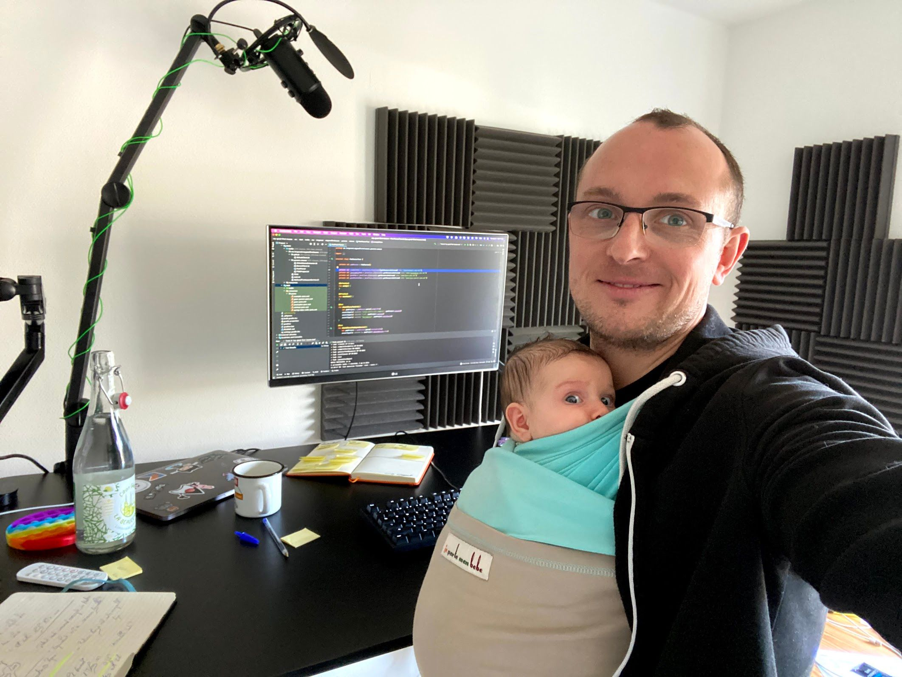
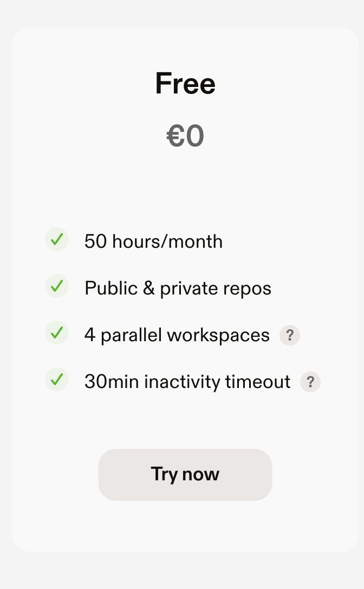

footer: @jlengrand
slidenumbers: true

# a (gentle) (iPad-driven) intro to 🍊Gitpod🍊 

<!-- Thanks to the people who came for the Security memes, and are now stuck here for my talk :)  -->

---
# 👋👋

 

- Julien Lengrand-Lambert
- Leading #devrel **@Adyen**
- Gitpod Hero
- Kotlin GDE 
- **@jlengrand**

 

- #DevRel #Kotlin #Gardening 

---

## What's Gitpod anyway?
<!-- How many of you already heard about Gitpod? -->

---

<!--  -->

<!-- --- -->

<!-- --- -->

>  Spin up fresh, automated dev environments for each task, in the cloud, in seconds.
-- Gitpod

---

# 🤢

<!-- Big corps, VM in the cloud, remote envs inside latest MBP, .... NOT A FAN -->

---

# Gitpod

---

# 🤩

---

<!-- https://contribute.dev/ -->

<!-- --- -->

## Let's see why

---

<!-- Insert demos -->

<!-- --- -->

## What 🍊Gitpod🍊 isn't 

---

## What 🍊Gitpod🍊 isn't 

* Heroku-like
* a shared dev environment

---

## Perfect use cases

---

## Perfect use cases

* Project "starter"
* I work with many setups
* WF anywhere
* Live demos
* Workshops, trainings, ...

---

---

# Thank you!
